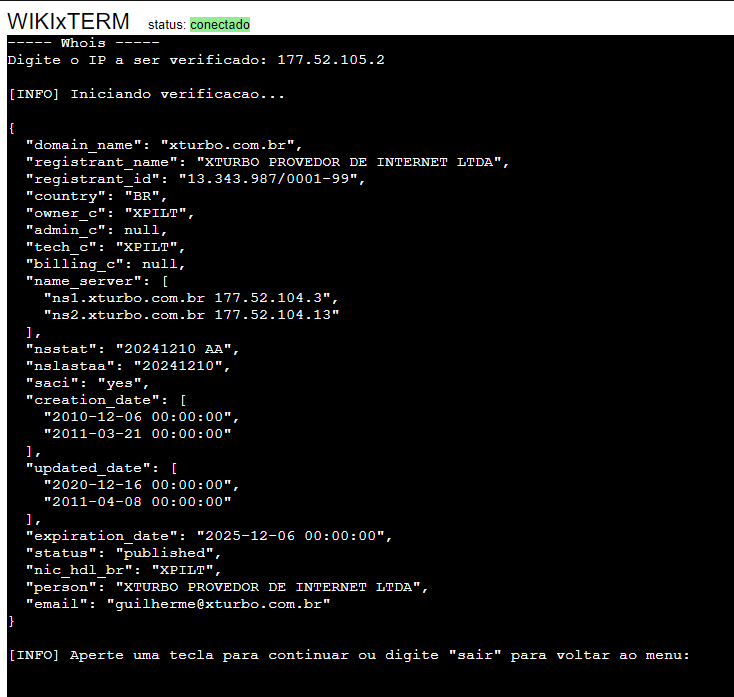

# XTurbo Tools

A simples swiss army knife of network tools.
Created to help support team of ISP XTurbo troubleshoot network issues. 
The tool runs inside a HTTP server, which uses a Python Library called [pyxterm.js](https://github.com/cs01/pyxtermjs).

Tools included:
- Check MAC Owner using [MAC Vendors API](https://macvendors.com)
- Port Scanner
- Ping and Tracer
- Check IP Whois
- Check DNS answer
- Check BGP ANS info

Examples: 
 
 
 
  

Back end by [Alex Colombari](https://github.com/alexcolombari) 
Front end by [Natan Cavarsan](https://github.com/Natan-yoko)
